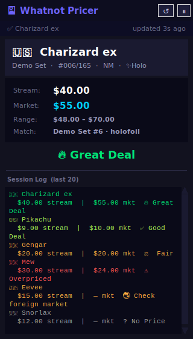

# Whatnot Pricer

Real-time Pokémon card price overlay for Whatnot live streams. It watches a region of your screen, uses Claude's vision to read the card being sold and its current price, looks up the TCGPlayer market price through pokemontcg.io, and shows in a floating window whether the price is a good deal.



<sub>The real overlay window, rendered from <code>overlay.py</code> with made-up demo data ("Demo Set", invented prices). It was rendered on Linux, so fonts differ slightly from Windows.</sub>

## How it works

1. **Capture.** Every 2.5 s, [mss](https://github.com/BoboTiG/python-mss) grabs the selected screen region.
2. **Skip unchanged frames.** A 160×120 thumbnail is compared with the last frame Claude saw. If the mean absolute pixel difference is below 8 (on a 0–255 scale), nothing is sent. After 3 frames in a row with no card, the loop slows to every 5 s.
3. **Read the card.** Changed frames are sent to Claude as a JPEG (long edge at most 1568 px) together with a `report_card` tool. `tool_choice` forces that tool, so the reply is always a structured object: name, set, collector number, language, holo, grading, stream price and confidence. The fields are validated and normalized before use.
4. **Price it.** `prices.py` queries [pokemontcg.io](https://docs.pokemontcg.io/) with name + collector number, then name + set, then name alone, stopping at the first query with results (newest printing first). It picks the best match (has a market price, then matching set size such as the `102` in `4/102`, then exact name) and the TCGPlayer price bucket that fits the card (holofoil, reverse holofoil, unlimited, 1st Edition or normal). Successful lookups are cached for 10 minutes.
5. **Rate the deal** and show it in the overlay and session log.

API errors never stop the loop. Rate limits, network problems and bad keys appear in the overlay's status bar. A failed frame doesn't count as seen, so the next capture is sent again after an exponential backoff (5 s, 10 s, 20 s … capped at 60 s).

## Features

- Drag to select any region of your screen to monitor; the selection is remembered
- Claude vision detects card name, set, number, holo status, grade and stream price
- TCGPlayer market / low / high prices via pokemontcg.io (free, no key needed), plus a **Match** row showing which printing was priced
- Deal indicator: 🔥 Great Deal / ✅ Good Deal / ⚖️ Fair / ⚠️ Overpriced
- Always-on-top floating overlay, draggable and semi-transparent
- Scrollable session log of the last 20 cards
- Skips unchanged frames and caches repeated lookups, so it stays fast during rapid sales
- Foreign card detection (🇯🇵 🇨🇳 🇰🇷) with a note that TCGPlayer prices are English only

## Requirements

- Python 3.10+ with Tkinter (included in the python.org installers)
- An Anthropic API key from [console.anthropic.com](https://console.anthropic.com)
- Windows, macOS or Linux (see the platform notes below)

## Setup

**Windows (PowerShell)**

```powershell
git clone https://github.com/nathangin/whatnot-pricer.git
cd whatnot-pricer
py -m venv .venv
.venv\Scripts\Activate.ps1
pip install -r requirements.txt
```

If PowerShell refuses to run `Activate.ps1`, run `Set-ExecutionPolicy -Scope CurrentUser RemoteSigned` once.

**macOS / Linux**

```bash
git clone https://github.com/nathangin/whatnot-pricer.git
cd whatnot-pricer
python3 -m venv .venv
source .venv/bin/activate
pip install -r requirements.txt
```

Platform notes:

- **macOS:** allow your terminal (or VS Code) under System Settings → Privacy & Security → Screen Recording, otherwise captures show only the desktop. Homebrew Python needs `brew install python-tk`.
- **Linux:** install Tk (`sudo apt install python3-tk` on Debian/Ubuntu). mss captures through X11, so use an X11 session; under Wayland the capture may come back black.

Then create a `.env` file next to `main.py`:

```ini
# Required
ANTHROPIC_API_KEY=sk-ant-your-key-here

# Optional: Claude model that reads the stream (default: claude-sonnet-5)
# WHATNOT_MODEL=claude-haiku-4-5-20251001

# Optional: pokemontcg.io key, sent as the X-Api-Key header for higher rate limits
# POKEMONTCG_API_KEY=your-key
```

`.env` is loaded both when you run from a terminal and from the VS Code launch config. Variables already set in your shell take precedence over the file. `.env` is gitignored.

## Run

```bash
python main.py
```

On first launch, drag a box around the Whatnot stream on your primary monitor. Include the card and the price display, and keep the box tight so the card is large. The selection is saved to `region.json` and reused next time. In the overlay, **↺** re-selects the region and **⏸ / ▶** pauses and resumes scanning. The status bar shows what the scanner is doing, and the console logs each lookup.

## How the deal rating is computed

```
ratio = stream price ÷ TCGPlayer market price of the matched printing
```

| Ratio | Rating |
|-------|--------|
| ≤ 0.80 | 🔥 Great Deal |
| > 0.80 and ≤ 0.95 | ✅ Good Deal |
| > 0.95 and ≤ 1.05 | ⚖️ Fair |
| > 1.05 | ⚠️ Overpriced |

For example, $40 on stream against a $55 market price is a ratio of 0.73, so it is a Great Deal. If the stream price is missing, the rating is ❓ No Price. If there is no market price, the price panel says why (not on TCGPlayer, or the lookup failed) and the deal row stays blank. Non-English cards are never rated against English prices and show 🌏 Check foreign market instead. The thresholds live in `prices.DEAL_THRESHOLDS`.

## Models and cost

| Model | `WHATNOT_MODEL` | Price per million tokens (input / output) |
|-------|-----------------|-------------------------------------------|
| Claude Sonnet 5 (default) | `claude-sonnet-5` | $2 / $10 |
| Claude Haiku 4.5 (faster, cheaper) | `claude-haiku-4-5-20251001` | $1 / $5 |

Prices are as listed on [Anthropic's pricing page](https://platform.claude.com/docs/en/about-claude/pricing) in September 2026.

Rough cost per request: an image costs about ⌈width/28⌉ × ⌈height/28⌉ input tokens, so a 720 × 1280 region is about 1,200 tokens. Add roughly 1,100 tokens for the prompt, tool definition and tool-use overhead, plus about 100 output tokens. That comes to about **$0.006 per request on Sonnet 5** and **$0.003 on Haiku 4.5**. Requests are sent only when the picture changes, at most one every 2.5 s. A busy stream that changes on every capture therefore costs up to about $8 per hour on Sonnet 5 or $4 per hour on Haiku 4.5. Static or card-free stretches cost much less. Check the Claude Console for your actual usage.

Some newer models (for example Sonnet 5.5 and Opus 5.5) do not support forcing a specific tool and return a 400 error. If that happens, the app logs it once and switches to `tool_choice: auto` for the session, so any current model can be used.

## Files

| File | Purpose |
|------|---------|
| `main.py` | Entry point: loads `.env`, region selector, wires the overlay to the monitor |
| `monitor.py` | Capture thread: frame-change detection, Claude vision via forced tool use, input normalization, backoff |
| `prices.py` | pokemontcg.io lookup (query fallbacks, price-bucket choice, 10-minute cache) and the deal rating |
| `overlay.py` | Tkinter overlay: card panel, prices, deal indicator, session log, region border |
| `tests/` | Offline pytest suite |
| `.vscode/launch.json` | "Whatnot Pricer" debug configuration (uses your selected interpreter and `.env`) |

The pure logic (deal thresholds, price selection, query building, frame-change detection, tool-input normalization, backoff and the cache) is kept separate from screen, network and UI code, so it can be tested without any of them.

## Running the tests

```bash
pip install -r requirements-dev.txt
python -m pytest
```

The suite runs offline and needs no API key: pokemontcg.io responses and the Anthropic client are fakes, and Claude's replies are built as real SDK `Message` objects. The overlay UI tests need a display and are skipped without one; on a headless Linux machine, run `xvfb-run python -m pytest` to include them.

## Limitations

- **English-only prices.** TCGPlayer data from pokemontcg.io covers English cards. Japanese, Chinese, Korean and other non-English cards are flagged but not priced.
- **Vision misreads.** Claude can misread a name, collector number or price, especially on small or blurry streams. Low-confidence reads show "(?)", and the Match row shows which printing was priced so you can sanity-check it.
- **Graded cards are compared with raw prices.** TCGPlayer market prices are for ungraded cards, so slabs usually read as Overpriced.
- **Edition and variants.** 1st Edition isn't detected; when both prices exist, the unlimited price is used.
- **Snapshot prices.** The stream price is the bid at the moment of capture, and the market price is pokemontcg.io's TCGPlayer data, not live listings.
- **pokemontcg.io is deprecated.** Its docs say new API key registrations are closed, existing keys work through March 1, 2027, and apps should migrate to Scrydex. Requests without a key still work at lower limits (1,000 per day, 30 per minute).
- **Primary monitor only.** Region selection shows the primary monitor.
